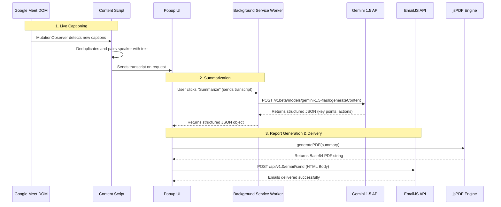

# RaveNote: AI-Powered Google Meet Summarizer

RaveNote is a 100% client-side Chrome Extension that captures Google Meet conversations in real-time, generates structured meeting minutes using Google's Gemini 1.5 Flash API, and automatically distributes professional PDF reports to participants via EmailJS.

## 🚀 Features
- **Real-Time Capturing**: Uses MutationObservers to silently capture speaker names and captions.
- **Serverless Architecture**: All processing happens directly in your browser. No backend server needed.
- **Gemini API Integration**: Fast, cheap, and accurate structured JSON outputs from Gemini 1.5 Flash.
- **Local PDF Generation**: Uses `jsPDF` to build styled, branded meeting reports.
- **Automated Email Delivery**: Sends the summary via EmailJS directly to participants' inboxes.

## 🧠 System Architecture

The entire system is designed to run securely within the Chrome Extension sandbox. API keys are stored securely in `chrome.storage.local`.

## 📊 Expected Outcomes

### 1. The Chrome Extension Interface
Users can track live word counts, see transcript previews with color-coded speaker chips, and enter recipient emails before clicking a single button to summarize.

### 2. The Final Deliverable
The generated PDF and Email contain:
- **Meeting Meta**: Title, Date, Duration
- **Executive Summary**: A quick 3-sentence overview of the meeting
- **Key Points**: A bulleted list of the 5-8 most important topics discussed
- **Action Items**: A clean table assigning owners to specific tasks
- **Decisions**: A log of finalized decisions made on the call
- **Per-Speaker Summaries**: A breakdown of what *each* participant contributed, highlighting their exact value to the meeting.

## ⚙️ Setup Instructions

### 1. Install the Extension
1. Clone or download this repository.
2. Open Chrome and navigate to `chrome://extensions`.
3. Enable **Developer mode** in the top right.
4. Click **Load unpacked** and select the `chrome-extension` directory.

### 2. API Keys Configuration
You need two free API keys to run RaveNote:
1. **Gemini API Key**: Get a free key from [Google AI Studio](https://aistudio.google.com/app/apikey).
2. **EmailJS Credentials**: Sign up at [EmailJS.com](https://emailjs.com) and create a Gmail service and a template. You need the Service ID, Template ID, and Public Key.
   
*Click the extension icon, open the **Settings (Options)** page, and enter these keys.*

### 3. Usage
1. Open a Google Meet call.
2. **Turn on Captions (CC)** (Crucial step!).
3. Open the RaveNote extension.
4. Add recipient emails and click **Summarize & Email PDF**.
