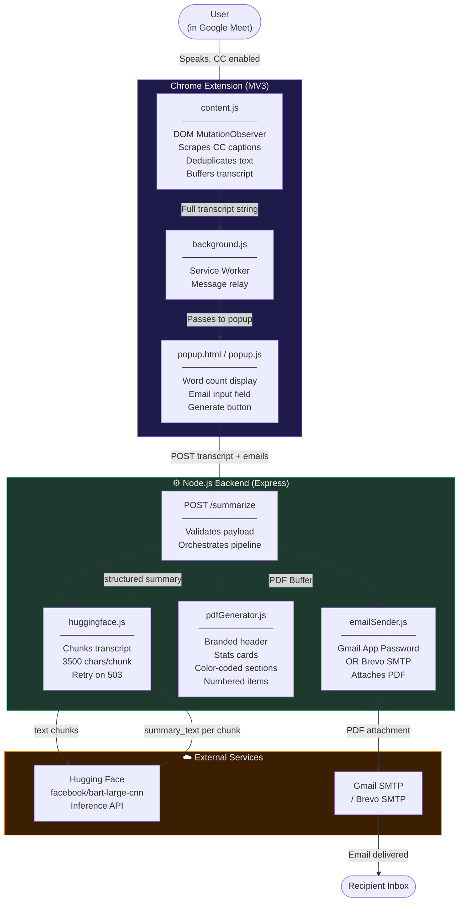
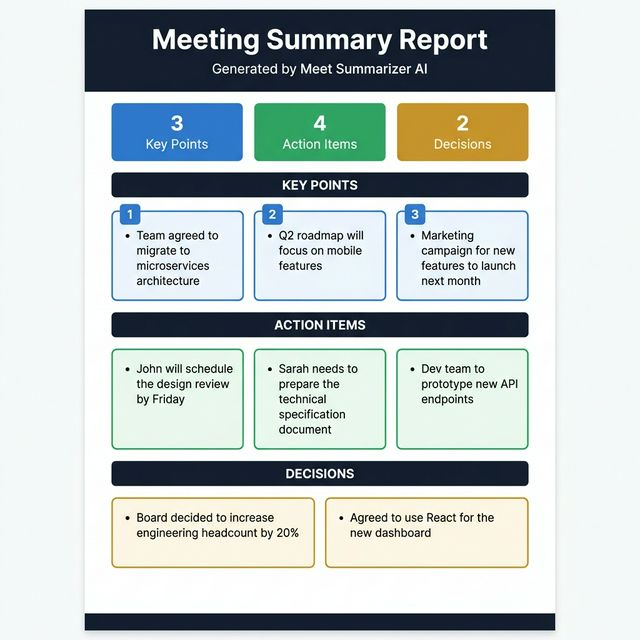

<div align="center">
  
  <h1>🎙️ Google Meet Auto-Summarizer</h1>
  <p>
    An intelligent Chrome Extension &amp; Node.js Backend that captures live Google Meet captions,<br>
    summarizes them using Hugging Face AI, generates a professional PDF report, and emails it to participants.
  </p>

  [](https://opensource.org/licenses/MIT)
  [](https://nodejs.org/)
  [](https://developer.chrome.com/docs/extensions/mv3/)
  [](https://huggingface.co/)
</div>

---

##  Features

| Feature | Description |
|---|---|
|  **Live Caption Capture** | Silently reads captions directly from the Google Meet DOM — no audio recording |
|  **Smart Deduplication** | Filters out repeated words and partial phrases in real-time |
|  **AI Summarization** | Uses Hugging Face `facebook/bart-large-cnn` to extract Key Points, Action Items & Decisions |
|  **Auto-Chunking** | Handles long meetings by splitting transcripts so token limits are never exceeded |
|  **Professional PDF** | Generates a branded, color-coded PDF report with stats, sections & numbered items |
|  **Email Automation** | Sends the PDF directly to all participant emails (Gmail or Brevo SMTP) |

---

##  System Architecture



### Flow

```
Google Meet (CC Captions)
        │
        ▼
┌─────────────────────────────┐
│    Chrome Extension         │  ← Reads DOM mutations from .caption element
│  content.js + background.js │  ← Buffers full transcript
│  popup.html + popup.js      │  ← UI: word count, email input, send button
└────────────┬────────────────┘
             │  POST /summarize  {transcript, emails[]}
             ▼
┌─────────────────────────────────────────┐
│         Node.js Backend (Express)        │
│                                         │
│  1. Chunk transcript (3500 chars/chunk) │
│  2. Call HF BART-large-cnn per chunk   │──► Hugging Face Inference API
│  3. Combine + parse Key/Action/Decision │
│  4. Generate PDF (pdfkit)               │
│  5. Send Email (nodemailer)             │──► Gmail / Brevo SMTP
└─────────────────────────────────────────┘
             │
             ▼
      PDF email in inbox
```

---

## 📸 Output Proof

### Chrome Extension Popup
> Live word count, transcript preview, email entry, and one-click summarization.

<div align="center">
  
</div>

### Generated PDF Report
The PDF is professionally designed with:
- **Branded header** — dark navy with report title and timestamp
- **Stats row** — count cards for Key Points / Action Items / Decisions
- **Color-coded sections** — blue (Key Points), green (Action Items), amber (Decisions)
- **Numbered item cards** with accent borders
- **Professional footer** with confidentiality note

---

##  Getting Started

### Prerequisites

- **Node.js** v16+ — [nodejs.org](https://nodejs.org/)
- **Hugging Face token** (Fine-grained, with `Make calls to Inference Providers` permission) — [Get it here](https://huggingface.co/settings/tokens)
- **Gmail App Password** (requires 2FA enabled) — [Generate one here](https://myaccount.google.com/apppasswords)  
  _Or use a free [Brevo](https://brevo.com) SMTP account instead_

---

### 1️ Backend Setup

```bash
cd backend
npm install
```

Create your `.env` file:

```env
PORT=3000

# Hugging Face — Fine-grained token with "Make calls to Inference Providers" checked
HF_API_KEY=hf_your_token_here

# Email — Gmail with App Password
EMAIL_USER=your_email@gmail.com
EMAIL_PASS=your_16_char_app_password
EMAIL_SERVICE=gmail

# OR — Brevo SMTP (no 2FA needed)
# EMAIL_USER=your_brevo_login
# EMAIL_PASS=your_brevo_master_password
# SMTP_HOST=smtp-relay.brevo.com
# SMTP_PORT=587
```

Start the server:

```bash
npm start
# → [Server] Listening on http://localhost:3000
```

---

### 2️ Chrome Extension Setup

1. Open Chrome → navigate to `chrome://extensions`
2. Enable **Developer mode** (top-right toggle)
3. Click **Load unpacked** → select the `chrome-extension/` folder
4. Pin the extension to your toolbar

---

##  How to Use

1. Start a **Google Meet** call at `meet.google.com`
2. 🚨 **Enable live captions** — click the **CC** button at the bottom of Meet
3. Click the extension icon in your toolbar — watch word count rise in real time
4. When the meeting ends, enter recipient emails (comma-separated)
5. Click **Generate Summary & Email PDF**
6. In seconds, a professional PDF summary arrives in the inbox ✅

---

##  Tech Stack

| Layer | Technology |
|---|---|
| Chrome Extension | HTML, CSS, Vanilla JS (Manifest V3) |
| Backend | Node.js, Express.js |
| AI Model | Hugging Face `facebook/bart-large-cnn` via Inference API |
| PDF Generation | `pdfkit` |
| Email | `nodemailer` (Gmail App Password or Brevo SMTP) |
| HTTP Client | `axios` |

---

##  Project Structure

```
extension/
├── chrome-extension/
│   ├── manifest.json       # MV3 config
│   ├── content.js          # Caption scraper (DOM observer)
│   ├── background.js       # Service worker
│   ├── popup.html          # Extension popup UI
│   ├── popup.js            # Popup logic + API call
│   └── styles.css          # Popup styling
│
├── backend/
│   ├── server.js           # Express app entry point
│   ├── routes/
│   │   └── summarize.js    # POST /summarize route
│   └── services/
│       ├── huggingface.js  # AI summarization + chunking
│       ├── pdfGenerator.js # Professional PDF builder
│       └── emailSender.js  # Nodemailer (Gmail / SMTP)
│
├── assets/
│   ├── architecture.png    # Architecture diagram
│   └── pdf_output.png      # PDF output sample
│
└── .env                    # (gitignored) your secrets
```

---

##  Contributing

Contributions, issues, and feature requests are welcome!

1. Fork the Project
2. Create your Feature Branch (`git checkout -b feature/AmazingFeature`)
3. Commit your Changes (`git commit -m 'Add AmazingFeature'`)
4. Push to the Branch (`git push origin feature/AmazingFeature`)
5. Open a Pull Request

---

<div align="center">
  <i>Built with ❤️ using Node.js, Chrome Extensions, and Hugging Face AI.</i>
</div>
